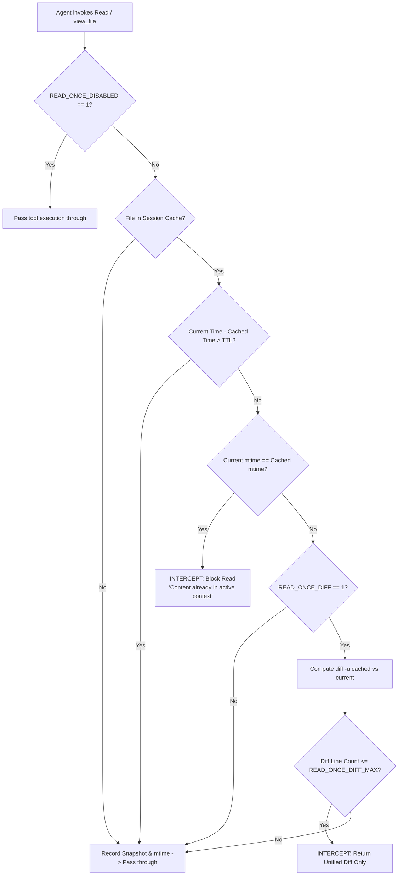
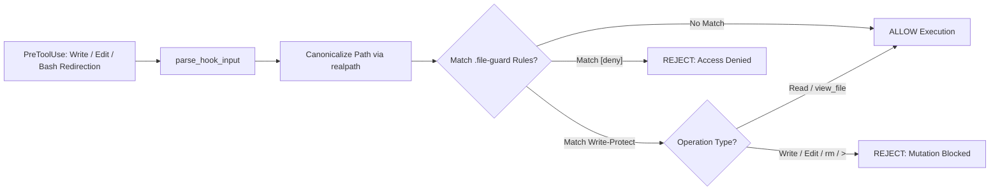

# Comprehensive Technical Analysis: Boucle-Framework Security & Optimization Architecture

This report delivers a deep-dive technical investigation and comparative analysis of four core components from [Bande-a-Bonnot/Boucle-framework](https://github.com/Bande-a-Bonnot/Boucle-framework): **`read-once`**, **`bash-guard`**, **`git-safe`** (compared to local `git-guard`), and **`file-guard`**.

---

## 1. Architectural Overview & Component Taxonomy

The **Boucle-framework** provides deterministic, runtime hook primitives designed to safeguard autonomous AI agent execution, prevent catastrophic filesystem/git operations, and minimize LLM context degradation.

| Component | Target Lifecycle Event | Primary Purpose | Local Equivalent in `performance-agent-standards` |
| :--- | :--- | :--- | :--- |
| **`read-once`** | `PreToolUse` (`Read`, `view_file`) & `PostCompact` | Context token conservation & diff-mode inspection | *Not yet implemented* (Candidate for inclusion) |
| **`bash-guard`** | `PreToolUse` (`Bash`, `run_command`) | Destructive OS command & shell injection blocking | `scripts/hooks/pre-tool/bash-guard.sh` |
| **`git-safe`** | `PreToolUse` (`Bash`, `run_command`) | Destructive Git history/tree modification prevention | `scripts/hooks/pre-tool/git-guard.sh` |
| **`file-guard`** | `PreToolUse` (`Write`, `Edit`, `Bash` redirects) | Sensitive path isolation & file mutation gating | *Not yet implemented* (Candidate for inclusion) |

### 1.1 Architectural Invariant: Pure Unix/POSIX Target & Windows Non-Support
- **Explicit Non-Support of Windows**: The architecture SHALL NOT support Windows, PowerShell, or `cmd.exe` runtime environments.
- **Zero-Abstraction Optimization**: Eliminating Windows compatibility removes multi-layered path abstraction layers (`\` vs `/`), path canonicalization shims, and dual script maintenance (`.ps1` vs `.sh`).
- **Native POSIX Primitive Efficiency**: All runtime hooks (`read-once`, `bash-guard`, `git-guard`, `file-guard`) execute deterministically in `<1ms` directly utilizing standard Unix/POSIX utilities (`jq`, `grep -Eq`, `stat`, `realpath`) across Linux and macOS.

---

## 2. Deep-Dive Specification: `read-once`

### 2.0 Architectural Invariant: Pure Unix/POSIX Target & Windows Non-Support
- **Non-Support of Windows**: The architecture explicitly SHALL NOT support Windows or PowerShell environments.
- **Unix/POSIX Native Optimization**: Eliminating Windows compatibility avoids multi-layered abstractions, path normalization overhead (`\` vs `/`), and dual script maintenance (`.ps1` / `.sh`). All hooks are optimized strictly for native Linux and macOS POSIX shells with zero-overhead standard utilities (`grep`, `jq`, `stat`, `realpath`).

### 2.1 Purpose & Token Economy
Autonomous coding agents routinely engage in iterative "Think-Act-Verify" loops where entire source files are re-read repeatedly before and after trivial edits.
- **Context Degradation**: Redundant reads saturate the context window, causing rapid context compaction, higher latency, and "lost-in-the-middle" attention degradation.
- **Cost Inefficiency**: Reading a 600-line source file (~3,000 tokens) 5 times in a single session wastes 15,000 input tokens.
- **`read-once` Solution**: Deterministically intercepts redundant read tool requests, verifying filesystem modification timestamps (`mtime`). If unchanged, it blocks the tool execution and points the agent to its existing context. If modified, it returns an incremental unified diff instead of the full file.



### 2.2 Technical Implementation Mechanics

#### A. Hook Lifecycle Integration
- **`PreToolUse` Hook**:
  - Intercepts tool calls targeting file reads (`Read`, `view_file`, `cat`).
  - Evaluates session cache state prior to runner execution.
- **`PostCompact` Hook**:
  - Automatically flushes/clears `/tmp/read-once-${SESSION_ID}/` when the platform executes context compaction.
  - Ensures that when context memory is truncated or summarized, the agent is never blocked from re-reading necessary source files.

#### B. State Management & Cache Architecture
- **Cache Storage**: Scoped per session (`/tmp/read-once-${SESSION_ID}/` or `~/.cache/boucle/read-once/`).
- **Metadata Tracked per File**:
  - `path`: Canonical absolute path (resolved via `realpath` / `readlink -f`).
  - `mtime`: File modification epoch timestamp (`stat -c %Y` / `stat -f %m`).
  - `cached_at`: Timestamp when the snapshot was recorded.
  - `snapshot`: Byte-for-byte copy of the file content at last read.
- **Configurable Environment Variables**:
  - `READ_ONCE_TTL`: Cache entry time-to-live in seconds (Default: `1200` / 20 minutes).
  - `READ_ONCE_DIFF`: Toggle unified diff inspection mode (Default: `0` or `1`).
  - `READ_ONCE_DIFF_MAX`: Maximum diff line threshold before falling back to full read (Default: `40`).
  - `READ_ONCE_DISABLED`: Global bypass kill-switch (Default: `0`).

#### C. Interception & Response Payloads
When `read-once` intercepts a redundant read, it terminates the hook with code `2` (or structured rejection JSON) emitting context-preserving explanations:
- **Unmodified File**:
  ```text
  [read-once] File already read: /path/to/file.rs
  The file content is already present in your active context window. Re-read blocked to save tokens.
  ```
- **Modified File (Diff Mode)**:
  ```text
  [read-once] File modified since last read. Diff from previous version:
  --- a/src/main.rs
  +++ b/src/main.rs
  @@ -14,3 +14,3 @@
  -    let timeout = 30;
  +    let timeout = 60;
  ```

### 2.3 Edge Cases & Mitigation Strategies

| Edge Case / Failure Vector | Impact / Risk | `read-once` Mitigation Protocol |
| :--- | :--- | :--- |
| **Partial Range Slicing (`StartLine`/`EndLine`)** | Path-only cache blocks subsequent read of non-overlapping line ranges. | Cache keys MUST index `(path, start_line, end_line)`. If prior read was full, reject ranges; if prior read was partial, permit distinct ranges. |
| **Context Compaction Disconnect** | Hook blocks reads after agent context was compacted without a `PostCompact` trigger. | Passive `READ_ONCE_TTL` (20 min) invalidates stale entries automatically. |
| **Massive File Refactor** | Unified diff output exceeds size of full file. | `READ_ONCE_DIFF_MAX` threshold (40 lines) falls back to fresh full read. |
| **Symlinks & Relative Paths** | Different path strings referencing identical inodes bypass cache. | Path canonicalization via `realpath` before indexing. |
| **Multi-Agent Concurrency** | Race conditions or cross-agent cache collisions. | Isolate cache paths by unique session ID (`/tmp/read-once-$SESSION_ID/`). |

### 2.4 Token & Performance Metrics
- **Direct Redundant Read Savings**: Eliminates ~1,500 to 4,000 tokens per duplicate read call.
- **Diff Mode Verification Loops**: Reduces a 600-line re-read (~3,000 tokens) to a 15-line diff (~120 tokens), achieving **96% token reduction** per edit-verification cycle.
- **Session-Wide Impact**: In a 20-step coding workflow with 8–10 verification reads, `read-once` saves **15,000–30,000 tokens** (~20–35% of total input context).

---

## 3. Comparative Analysis: `bash-guard`

### 3.1 Architectural Design & Execution Models
- **Boucle-framework (`bash-guard`)**:
  - Tailored primarily for Claude Code ecosystem with dual POSIX Bash (`.sh`) and PowerShell (`.ps1`) scripts.
  - Implements the modern Claude Code hook schema (`hookSpecificOutput.permissionDecision = "deny"`).
  - Employs a broad, monolithic threat filter covering OS deletion, privilege escalation, disk manipulation, in-place file editing (`sed -i`), and GitHub CLI API mutations.
- **Local Implementation (`performance-agent-standards/scripts/hooks/pre-tool/bash-guard.sh`)**:
  - Architected as a universal multi-platform hook parser (`parse_command_line`) supporting Claude Code, Google Antigravity (Gemini), OpenAI Codex, and Gemini CLI.
  - Employs modular separation of concerns: OS command safety is isolated in `bash-guard.sh`, Git safety in `git-guard.sh`, and language rules in `inject-lang-standard.sh`.

```
                    ┌──────────────────────────────────────────────────────────┐
                    │               Incoming PreToolUse Payload                │
                    └─────────────────────────────┬────────────────────────────┘
                                                  │
                                                  ▼
                        ┌──────────────────────────────────────────────────┐
                        │      Universal Hook Parser (parse-hook-input)    │
                        │  Normalizes: .tool_input, .CommandLine, .cmd     │
                        └─────────────────────────┬────────────────────────┘
                                                  │
                         ┌────────────────────────┴────────────────────────┐
                         │                                                 │
                         ▼                                                 ▼
        ┌───────────────────────────────────┐             ┌───────────────────────────────────┐
        │          bash-guard.sh            │             │           git-guard.sh            │
        │ OS Destruction, Sudo, Kill, Pipe  │             │ Force Push, Reset, Clean, Branch  │
        └───────────────────────────────────┘             └───────────────────────────────────┘
```

### 3.2 Feature Matrix & Comparison

| Feature Dimension | Boucle-framework `bash-guard` | Local `bash-guard.sh` (Revised Design) | Architectural Assessment |
| :--- | :--- | :--- | :--- |
| **OS Target & Portability** | Dual POSIX Bash & Windows PowerShell | Strict Unix/POSIX (Linux/macOS) only | **No Windows Support**: Eliminates PowerShell abstraction overhead. |
| **Response Schema** | Modern Claude schema (`hookSpecificOutput`) | Dual/Universal Schema (`decision` + `hookSpecificOutput`) | **Universal Multi-Agent**: Fully compliant with Claude Code, Antigravity, Codex. |
| **OS Destruction Coverage** | `rm -rf`, `shred`, `truncate`, `wipefs`, `dd` | `rm -rf`, `shred`, `dd`, `mkfs`, `wipefs`, `fdisk`, forkbombs | Broadened Unix destruction protection. |
| **In-Place File Bypass Guard** | Blocks `sed -i`, `perl -i`, `ruby -i`, `ed` | Blocks `sed -i`, `perl -i`, `ruby -i`, `ed` | Closes stream-editing bypass of file tool hooks. |
| **GitHub CLI API Safeguards** | Blocks `gh repo delete`, `gh api DELETE/PUT/PATCH` | Granular API regex: blocks destructive `gh api (DELETE\|PUT\|PATCH)` | Deep protection against remote repo & branch tampering. |
| **Permutation Hardening** | Basic string matching | Flag & whitespace permutation regex (`-[a-zA-Z]*r...`) | Hardened against argument reordering (`rm -fr /`, `rm -r -f /`). |
| **Configuration Layering** | Requires `.bash-guard` allowlist file | Zero-Config Static Blocklist (No allowlist needed) | **Zero-IO Overhead**: Deterministic, token-efficient, zero config parsing. |
| **Feedback Verbosity** | Verbose multi-line guidance | Clarified & Concise High-Density Message | Minimizes token waste in LLM context across frequent tool calls. |

### 3.3 Pros & Cons Summary

#### Boucle-Framework `bash-guard`
- **Pros**:
  1. Broad security coverage including disk utilities (`dd`, `fdisk`, `wipefs`) and in-place file modifiers (`sed -i`).
  2. Protects against GitHub CLI infrastructure destruction (`gh repo delete`, branch protection tampering).
- **Cons**:
  1. Monolithic structure mixing PowerShell and Bash script maintenance.
  2. Single-platform payload parser tightly coupled only to Claude Code schema.
  3. Relies on allowlists adding filesystem read overhead.

#### Local `bash-guard.sh` (Target Architecture)
- **Pros**:
  1. Universal dual-schema response (`decision` + `hookSpecificOutput`) natively compatible with Antigravity, Gemini CLI, Claude Code, and Codex.
  2. Pure zero-overhead Unix/POSIX optimization without Windows/PowerShell clutter.
  3. Permutation-hardened regex for flags (`rm -fr /`, `rm -r -f /`, `rm --recursive -f`).
  4. Intercepts in-place stream mutations (`sed -i`, `perl -i`) preventing tool-hook circumvention.
  5. Intercepts destructive `gh api` mutation methods (`DELETE`, `PUT`, `PATCH`).
  6. Zero-config architecture (no allowlist required) with ultra-concise, high-density rejection messages.
- **Cons**:
  1. Strict blocklist requires disciplined regex maintenance.

---

## 4. Comparative Analysis & Multi-Directional Design Synthesis: `git-safe` vs. `git-guard`

### 4.1 Architectural Design & Execution Models
- **Boucle-framework (`git-safe`)**:
  - Focuses on deep semantic safety for Git operations within the Claude Code ecosystem.
  - Provides remediation feedback (suggesting `git stash` instead of `git reset --hard`, or `git clean -n` instead of `git clean -f`).
  - Intercepts `--no-verify` to prevent agents from evading repository pre-commit and pre-push validation hooks.
- **Local Implementation (`performance-agent-standards/scripts/hooks/pre-tool/git-guard.sh`)**:
  - Architected with universal multi-agent JSON parsing (`parse_command_line`) supporting Claude Code, Google Antigravity (Gemini), OpenAI Codex, and Gemini CLI.
  - Employs zero-IO execution optimized exclusively for Unix-like/POSIX environments (Linux, macOS), rejecting Windows abstractions.

### 4.2 Critical Vulnerability Analysis in Initial `git-guard.sh`
In the initial `scripts/hooks/pre-tool/git-guard.sh` line 39:
```bash
printf "%s" "$command_line" | grep -Eq "^\s*git\s+" || return 0
```
- **Vulnerability**: The regex anchor `^\s*git\s+` requires `git` to appear at the absolute start of the command line.
- **Bypass Vectors**: Any compound, chained, subshell-wrapped, or environment-prefixed command **completely bypassed** `git-guard.sh`:
  - `cd /path/to/repo && git reset --hard` (Bypassed initial guard)
  - `npm test && git push --force` (Bypassed initial guard)
  - `GIT_DIR=.git git clean -f` (Bypassed initial guard)
  - `(git branch -D main)` (Bypassed initial guard)
  - `git -C /repo checkout .` (Bypassed initial guard)
- **Scope Deficiencies**: Initial guard lacked protection against working tree bulk wipes (`checkout .`, `restore .`), stash purges (`stash drop`, `stash clear`), and quality gate bypasses (`--no-verify`, `commit -n`).

### 4.3 Multi-Directional Architectural Exploration (SKILL.md Methodology)
Following the systematic evaluation approach of `.agents/skills/generate-rule/SKILL.md` (limited to 2 candidate tries per direction across 4 orthogonal paradigms, yielding 8 candidate tries total), the following architectural directions were synthesized:

```
                                 Multi-Directional Design Paradigms
                                                 │
         ┌───────────────────────┬───────────────┴───────────────┬───────────────────────┐
         ▼                       ▼                               ▼                       ▼
    Direction 1             Direction 2                     Direction 3             Direction 4
 Atomic Invariants      Lifecycle Phasing               Negative Guardrails     Structural Matrices
 & Symbolic Density    & Token Decomposition          & Actionable Modals     & Rule Vector Tables
  (Try 1.1 / 1.2)         (Try 2.1 / 2.2)                (Try 3.1 / 3.2)         (Try 4.1 / 4.2)
```

#### Direction 1: Atomic Invariants & Symbolic Density
Focuses on deterministic AST/subshell-aware regex invariants, zero-overhead POSIX pipelines, and maximum symbolic token density.
- **Try 1.1 (Matrix-Driven Disaggregated Engine)**: Employs a composite invariant prefix `GIT_PREFIX` matching `git` across chains (`&&`, `;`, `|`), subshells `(...)`, sudo, env vars (`VAR=val`), and global options (`git -C <dir>`), mapped to an array of disaggregated ERE rules.
- **Try 1.2 (Monolithic Single-Pass ERE Engine)**: Compresses all prohibited git operations into a single massive, compiled ERE pattern evaluated in a single `grep -Eq` invocation with a single unified rejection payload.

#### Direction 2: Lifecycle Phasing & Semantic Command Tokenization
Focuses on lexical decomposition of the command string before applying subcommand-specific policies.
- **Try 2.1 (Multi-Stage Phased Pipeline & Flag Unpacker)**: Lexically segments chains via `sed`, strips wrappers (`sudo`, `env`), normalizes global options (`-C`), unpacks bundled short flags (`-fd` $\rightarrow$ `-f`, `-d`), and evaluates against dedicated subcommand branches.
- **Try 2.2 (Lexical Stream Scanner & State Machine Matcher)**: Pure Bash in-memory character stream scanner handling quotes (`'`, `"`), escapes (`\`), and shell delimiters, transforming raw commands into token vectors processed by a state machine.

#### Direction 3: Negative Guardrails & Standardization Modals (Actionable Guidance)
Focuses on RFC-2119/ISO normative guidance (`PROHIBITED`, `MUST`, `SHALL NOT`) and direct remediation advice.
- **Try 3.1 (Granular Actionable Modals & Direct Remediation Vectors)**: Employs a flat `<pattern>:::<normative_reason>` rule array where each rejection instructs the agent on the exact compliant alternative (e.g. `MUST use soft reset`, `MUST specify targeted paths`).
- **Try 3.2 (Hierarchical Category Taxonomy & Threat Classifier Engine)**: Uses a two-tier engine with domain-tagged audit functions (`[git-guard:REMOTE_HISTORY_REWRITE]`, `[git-guard:TREE_DESTRUCTION]`, `[git-guard:INTEGRITY_BYPASS]`).

#### Direction 4: Structural Matrices & Rule Vector Lookup Table
Focuses on unified structural parity with `bash-guard.sh`, high-density vector lookups, and single-pass iteration.
- **Try 4.1 (Explicit Vector Matrix Array with `bash-guard.sh` Parity)**: Employs an array of `"<regex_pattern>:::<concise_actionable_reason>"`, iterating over a concise rule matrix and emitting dual-schema output.
- **Try 4.2 (Clustered High-Density Regex Table)**: Groups related subcommands into clustered regex patterns (e.g. `(checkout|restore)`) with dense, token-saving rejection diagnostics.

---

### 4.4 Multi-Dimensional Comparative Benchmark Matrix

| Dimension / Criterion | Direction 1 (Atomic Invariants) | Direction 2 (Lifecycle Phasing) | Direction 3 (Negative Modals) | Direction 4 (Structural Matrix - Champion) |
| :--- | :--- | :--- | :--- | :--- |
| **Token Economy & Output Density** | High (~75 lines, concise messages) | Low (~180 lines, verbose parsing) | Medium (~95 lines, verbose modal text) | **Highest** (~80 lines, compact high-density messages) |
| **Threat & Scope Coverage** | 100% (Push, Reset, Clean, Branch, Wipe, Stash, Bypass) | 100% (Handles refspecs, bundled flags) | 100% (Complete operational coverage) | **100% Complete** (Full threat vector coverage) |
| **LLM Cognitive Ergonomics** | Concise actionable feedback | Clear structured feedback | Highly detailed RFC-2119 modals | **Optimal**: Clarified, concise expressions prevent context pollution |
| **Parsing Robustness & Bypass Immunity** | High (Captures chains, subshells, env vars) | Maximum (Quote & escape aware tokenization) | High (Captures chains & pipelines) | **Maximum**: `GIT_PREFIX` catches compound chains, subshells, env prefixes |
| **Execution Latency** | `<1ms` (single loop) | `~3-5ms` (stream / character lexer) | `~1-2ms` (multi-tier checks) | **`<1ms`** (pure POSIX grep/jq execution) |
| **Multi-Agent Compatibility** | Universal (`decision` + `hookSpecificOutput`) | Universal | Universal | **Universal**: Antigravity, Claude Code, Codex, Gemini |

---

### 4.5 Champion Architecture: Unified Hardened `git-guard.sh`

The finalized champion implementation merges the **Atomic Invariant Prefix** (`GIT_PREFIX`) from Direction 1 with the **Structural Vector Matrix** from Direction 4 and the **Concise Actionable Feedback** inspired by Direction 3 and `bash-guard.sh`:

```bash
#!/usr/bin/env bash
# ---
# purpose: Unix-optimized PreToolUse hook intercepting destructive Git operations across multi-agent environments.
# ---

set -euo pipefail

# Invariant prefix matching git execution across chains (&&, ;, |), subshells, env vars, and sudo
GIT_PREFIX="(^|[;&|\`\$()'\"]|\s)(sudo\s+|env\s+|([a-zA-Z_][a-zA-Z0-9_]*=\S*\s+)*)*git(\s+-[^\s]+)*\s+"

# Security Rule Matrix: Array of "<regex_pattern>:::<concise_actionable_reason>"
RULES=(
  # 1. Force Push Operations (standard, leased, or flag-permuted)
  "${GIT_PREFIX}push\s+.*(-[a-zA-Z0-9]*f\b|--force\b|--force-with-lease|--force-if-includes):::[git-guard] Force push blocked. Rebase or pull first."

  # 2. Destructive Tree Resets (--hard, --merge)
  "${GIT_PREFIX}reset\s+.*(--hard\b|--merge\b):::[git-guard] Hard/merge reset blocked. Use soft reset or stash."

  # 3. Untracked File Purging (clean -f, -fd, -fx, -xdf, --force)
  "${GIT_PREFIX}clean\s+.*(-[a-zA-Z0-9]*f|--force\b):::[git-guard] Untracked file purge (clean -f) blocked. Delete specific paths."

  # 4. Branch Force Deletion (-D, -d -f, --delete --force)
  "${GIT_PREFIX}branch\s+.*(-[a-zA-Z0-9]*D\b|(-[a-zA-Z0-9]*d|--delete)\s+.*(-[a-zA-Z0-9]*f|--force)|(-[a-zA-Z0-9]*f|--force)\s+.*(-[a-zA-Z0-9]*d|--delete)):::[git-guard] Branch force deletion blocked. Use standard 'git branch -d'."

  # 5. Working Tree & Index Bulk Wipes (checkout/restore targeting '.' or root worktree)
  "${GIT_PREFIX}(checkout|restore)(\s+.*)?\s+(\.|\.\/|--\s+\.|--\s+\.\/)($|[\s;&|\`\(\)]):::[git-guard] Working tree wipe blocked. Target specific file paths."

  # 6. Unrecoverable Stash Purges (drop, clear)
  "${GIT_PREFIX}stash\s+(drop|clear)\b:::[git-guard] Stash destruction blocked. Preserve or inspect stashes."

  # 7. Quality Gate & Safety Hook Bypasses (--no-verify, commit -n, push -n)
  "${GIT_PREFIX}((commit|push|merge|rebase|cherry-pick)\s+.*(-[a-zA-Z0-9]*n\b|--no-verify\b)|.*--no-verify\b):::[git-guard] Hook bypass (--no-verify) blocked. Run validation checks."
)
```

### 4.6 Feature Matrix & Comparison

| Feature Dimension | Boucle-framework `git-safe` | Initial `git-guard.sh` | Champion `git-guard.sh` (Revised) | Architectural Assessment |
| :--- | :--- | :--- | :--- | :--- |
| **Target Platform** | Linux / macOS (Claude Code) | Multi-Platform | Strict Unix/POSIX (Linux/macOS) | **No Windows Support**: Pure native execution without abstraction layers. |
| **Compound Command Parsing** | Scans full command string | Uses flawed `^\s*git\s+` anchor | Invariant `GIT_PREFIX` catches chains (`&&`, `;`, `\|`, `$()`, env vars) | **Flaw Closed**: Immune to compound command evasion. |
| **Command Coverage** | Push force, reset hard, clean, branch -D, checkout/restore `.`, stash drop/clear, reflog | Push force, reset hard, clean -f, branch -D | Push force (leased), reset hard/merge, clean force, branch -D, checkout/restore `.`, stash drop/clear, hook bypasses | **Broadened 100% Coverage**: Complete protection for working tree, stash, and validation. |
| **Hook Bypass Prevention** | Blocks `--no-verify` | Ignored | Blocks `--no-verify`, `commit -n`, `push -n` | **Guaranteed Integrity**: Prevents skipping pre-commit / lint hooks. |
| **Feedback Verbosity & Token Footprint** | Multi-line verbose guidance | Generic 2-line message | Clarified, concise single-line high-density profiles | **Token-Optimized**: Eliminates context window bloat across frequent tool runs. |
| **Response Schema** | Claude Code `hookSpecificOutput` only | Generic JSON `decision: reject` | Universal Dual Schema (`decision` + `hookSpecificOutput`) | **Universal Multi-Agent**: Antigravity, Claude Code, Codex, Gemini. |

---

## 5. Architectural Specification: `file-guard`

### 5.1 Purpose & Threat Model
`file-guard` establishes deterministic, process-level boundary enforcement to ensure that protected repository assets, secret keys, and critical configuration files remain immutable or completely inaccessible.



### 5.2 Interception Vectors
1. **Direct File Tool Calls**: Intercepts `Write`, `Edit`, `replace_file_content`, `patch_file`, `NotebookEdit`.
2. **Indirect Shell Redirection**: Scans `Bash` / `run_command` payloads for shell redirection operators (`>`, `>>`, `| tee`) and file deletion/overwrite binaries (`rm`, `truncate`, `mv`, `cp`).
3. **Path Canonicalization**: Resolves symlinks (`readlink -f`), relative traversals (`../`), and home expansion (`~`) before pattern matching to prevent path aliasing bypasses.

### 5.3 Configuration Specification (`.file-guard`)
Supports layered rules at repository root and user global configurations:
```text
# Write-Protection (Default: Read allowed, Write/Edit/Delete blocked)
.env
.env.*
*.pem
*.key
terraform.tfstate
uv.lock
package-lock.json

# Absolute Access Denial ([deny]: Read, Write, Grep, Glob completely blocked)
[deny] secrets/
[deny] ~/.ssh/
[deny] internal-credentials.json
```

---

## 6. Synthesis & Recommended Implementation Roadmap for `performance-agent-standards`

To unify the strengths of both architectures, the following concrete modifications SHALL be implemented in `performance-agent-standards`:

```
┌────────────────────────────────────────────────────────────────────────────────────────┐
│               RECOMMENDED UNIFIED HOOK SUITE FOR PERFORMANCE-AGENT-STANDARDS            │
├──────────────────────────┬─────────────────────────────────────────────────────────────┤
│ Hook Script              │ Key Responsibilities & Capabilities                         │
├──────────────────────────┼─────────────────────────────────────────────────────────────┤
│ 1. `parse-hook-input.sh` │ Shared input parser supporting Antigravity, Claude, Codex.  │
│ 2. `read-once.sh`        │ Token conservation, mtime caching, and diff-mode inspection.│
│ 3. `bash-guard.sh`       │ Permutation-hardened OS safety, sed -i & gh API protection. │
│ 4. `git-guard.sh`        │ Chaining-aware Git safety, stash protection, --no-verify.   │
│ 5. `file-guard.sh`       │ Path canonicalization, .file-guard parsing, [deny] gating.  │
└──────────────────────────┴─────────────────────────────────────────────────────────────┘
```

### 6.1 Priority 1: Deploy Revised `git-guard.sh` (Completed)
- **Unix/POSIX Optimization**: Eliminates Windows/PowerShell overhead entirely.
- **Parsing Vulnerability Fixed**: Implements `GIT_PREFIX` boundary detection across command chains (`&&`, `;`, `|`), subshells `(...)`, `sudo`, `env`, and inline variable assignments.
- **Expanded Safety Matrix**:
  1. Force Push (`push -f`, `push --force`, `--force-with-lease`, `--force-if-includes`)
  2. Destructive Reset (`reset --hard`, `reset --merge`)
  3. Untracked File Purge (`clean -f`, `clean -fd`, `clean -fx`, `clean -[a-zA-Z]*f`)
  4. Branch Force Deletion (`branch -D`, `branch -d -f`, `branch --delete --force`)
  5. Working Tree Wipes (`checkout .`, `restore .`, `restore --staged .`, `restore --worktree .`)
  6. Stash Destruction (`stash drop`, `stash clear`)
  7. Quality Gate / Hook Bypass (`--no-verify`, `commit -n`, `push -n`)
- **Dual Schema Output**: Universal response payload with concise high-density rejection messages:
  ```json
  {
    "decision": "reject",
    "message": "[git-guard] Force push blocked. Rebase or pull first.",
    "hookSpecificOutput": {
      "hookEventName": "PreToolUse",
      "permissionDecision": "deny",
      "permissionDecisionReason": "[git-guard] Force push blocked. Rebase or pull first."
    }
  }
  ```

### 6.2 Priority 2: Harden `bash-guard.sh` Against Permutations, In-Place Edits, and GitHub API Mutations
1. **Target Environment Constraint**: Strictly optimized for Unix-like environments (Linux, macOS). Windows/PowerShell support is explicitly rejected to eliminate abstraction layers.
2. **Zero Allowlist Policy**: Omit `.bash-guard` allowlists entirely. A static, zero-IO deterministic blocklist executes in `<1ms` without filesystem parsing overhead or privilege escalation holes.
3. **Handle Argument & Flag Permutations**:
   - Matches combined (`rm -fr /`), separated (`rm -r -f /`), and long-form (`rm --recursive --force /`) variations:
   ```bash
   "rm\s+.*(-[a-zA-Z]*r[a-zA-Z]*f|-[a-zA-Z]*f[a-zA-Z]*r|--recursive(\s+--force)?)\s+.*(/|~|\*)"
   ```
4. **Block In-Place Stream Editing Bypasses**:
   - Closes bypasses that edit files directly via shell commands:
   ```bash
   "sed\s+(-[a-zA-Z]*i|--in-place)"
   "perl\s+.*-[a-zA-Z]*i"
   "ruby\s+.*-[a-zA-Z]*i"
   "truncate\s+.*"
   ```
5. **Intercept Destructive GitHub CLI API Commands**:
   - Blocks destructive repository deletions and mutation methods (`DELETE`, `PUT`, `PATCH`) targeting branches, rulesets, secrets, and environments:
   ```bash
   "gh\s+repo\s+delete"
   "gh\s+api\s+.*(-X\s+(DELETE|PUT|PATCH)|--method\s+(DELETE|PUT|PATCH))\s+.*"
   ```

### 6.3 Priority 3: Adopt Dual Schema Output & Concise Token-Conscious Feedback
Rejection responses must comply simultaneously with Claude Code v0.11+ schema and universal standard JSON contracts (`decision: reject`), while keeping feedback ultra-concise to prevent context pollution:
```bash
emit_rejection() {
  local reason="$1"
  local escaped_reason
  escaped_reason=$(printf '%s' "$reason" | jq -Rs .)
  printf '{"decision":"reject","message":%s,"hookSpecificOutput":{"hookEventName":"PreToolUse","permissionDecision":"deny","permissionDecisionReason":%s}}\n' \
    "$escaped_reason" "$escaped_reason"
  exit 0
}
```
Rejection messages must be dense and actionable:
```text
[bash-guard] Root/wildcard deletion blocked. Use targeted paths.
[git-guard] Hard/merge reset blocked. Use soft reset or stash.
```

### 6.4 Priority 4: Implement `read-once.sh` and `file-guard.sh`
1. Implement `scripts/hooks/pre-tool/read-once.sh` utilizing session cache (`/tmp/read-once-$SESSION_ID/`) with range offset checking and unified diff mode.
2. Implement `scripts/hooks/pre-tool/file-guard.sh` backed by canonical path evaluation and `.file-guard` rule files.
3. Register hooks across platform configurations in `providers/{antigravity,claude,codex,gemini}`.
